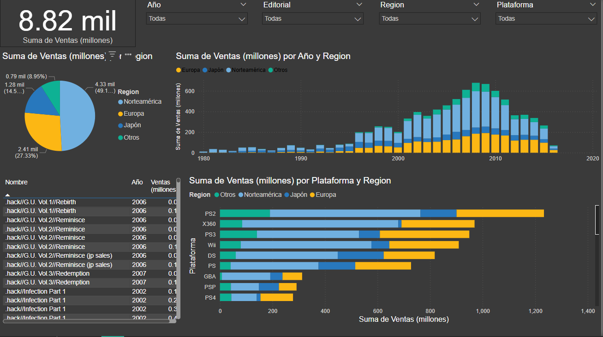

# Bubble Sort Performance Analysis

A small Python script that compares the performance of standard Bubble Sort and an optimized version by estimating the number of operations required to sort arrays of increasing sizes. Useful for visualizing algorithm efficiency and understanding time complexity.

## Key Features  
- Implements both standard and optimized Bubble Sort algorithms.  
- Estimates the number of operations performed during sorting.  
- Tests performance on arrays of increasing sizes (100 to 1000 elements).  
- Visualizes the results using a comparative line plot.

## Requirements  
- Python 3.x  
- matplotlib  

# Screenshot

